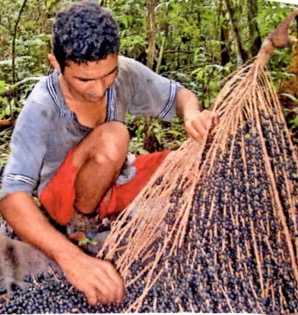
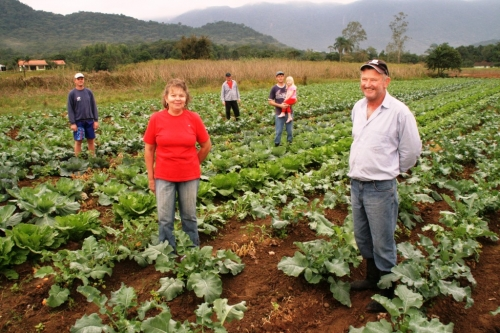
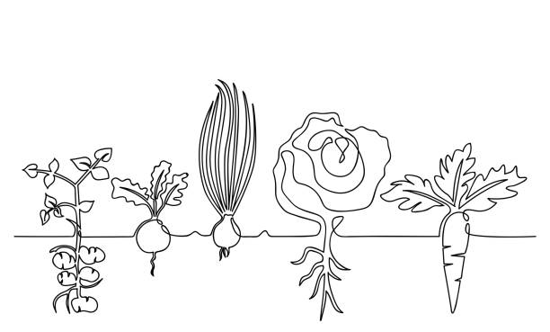
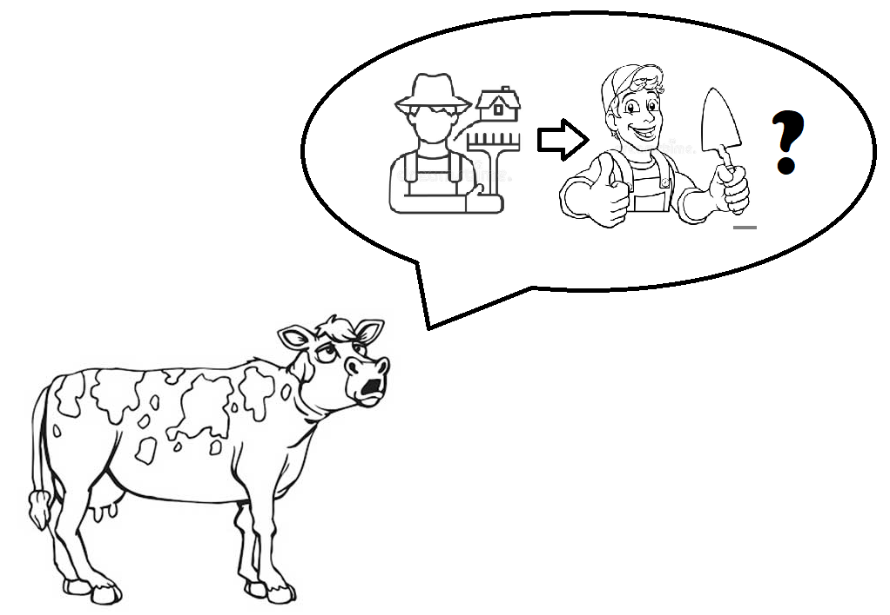
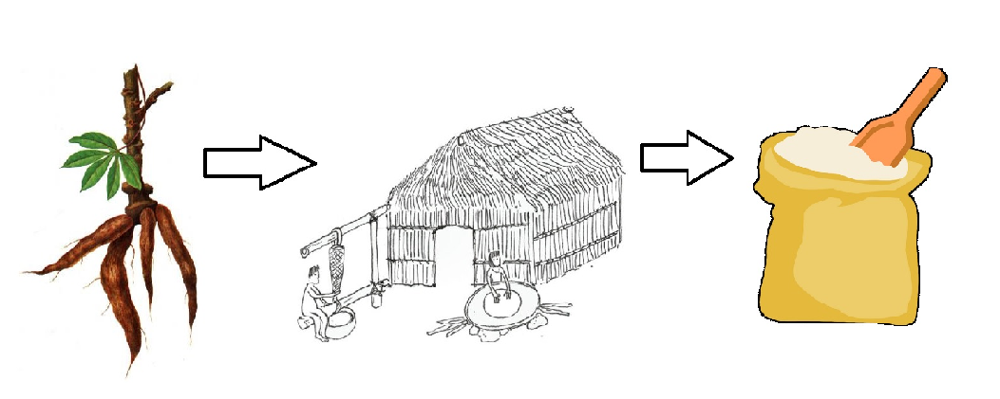
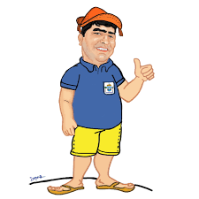
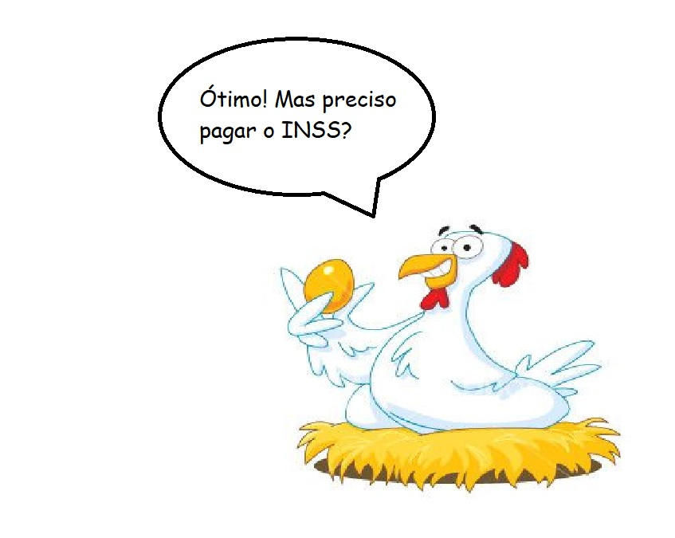

#direito-previdenciario #slides \## Relação jurídica previdenciária

conceito \| sujeitos

---
### Conceito
*Vínculo jurídico* que liga o *beneficiário* (segurado ou dependente) ao *ente previdenciário* e tem por *objeto* a *garantia* de obrigações de dar dinheiro (no caso dos benefícios) ou fazer (no caso dos serviços) no caso de ocorrência de eventos determinados, previstos em lei.
---

**Outras obrigações** - fornecer informações e documentos; - deixar de revisar o benefício previdenciário recebido de boa-fé por beneficiário da previdência após o prazo decadencial - etc. 31b8e172-b470-440e-83d8-e6b185028602:dAB5AHAAZQA6AFoAUQBBAHgAQQBEAGcAQQBNAFEAQQA1AEEARABZAEEATQBBAEEAMQBBAEMAMABBAE0AQQBCAGgAQQBHAE0AQQBaAEEAQQB0AEEARABRAEEAWgBnAEIAaABBAEcAVQBBAEwAUQBBADQAQQBHAEkAQQBPAFEAQQA1AEEAQwAwAEEATwBRAEIAagBBAEQARQBBAFkAZwBBADMAQQBHAEkAQQBaAEEAQQAzAEEARwBNAEEATQBBAEIAbQBBAEQARQBBAAoAcABvAHMAaQB0AGkAbwBuADoATgB3AEEAegBBAEQAQQBBAAoAcAByAGUAZgBpAHgAOgAKAHMAbwB1AHIAYwBlADoATABRAEEAdABBAEMAMABBAEMAZwBBAGoAQQBDAE0AQQBJAHcAQQBnAEEARgBNAEEAZABRAEIAcQBBAEcAVQBBAGEAUQBCADAAQQBHADgAQQBjAHcAQQBLAEEAQwAwAEEASQBBAEIAUABBAEMAQQBBAFoAUQBCAHUAQQBIAFEAQQBaAFEAQQBnAEEASABBAEEAKwBnAEIAaQBBAEcAdwBBAGEAUQBCAGoAQQBHADgAQQBJAEEAQQBvAEEARQBrAEEAVABnAEIAVABBAEYATQBBAEsAUQBBADcAQQBBAG8AQQBMAFEAQQBnAEEARQA4AEEASQBBAEIAaQBBAEcAVQBBAGIAZwBCAGwAQQBHAFkAQQBhAFEAQgBqAEEARwBrAEEANABRAEIAeQBBAEcAawBBAGIAdwBBAGcAQQBDAGcAQQBjAHcAQgBsAEEARwBjAEEAZABRAEIAeQBBAEcARQBBAFoAQQBCAHYAQQBDAEEAQQBiAHcAQgAxAEEAQwBBAEEAWgBBAEIAbABBAEgAQQBBAFoAUQBCAHUAQQBHAFEAQQBaAFEAQgB1AEEASABRAEEAWgBRAEEAcABBAEMANABBAEMAZwBBAHEAQQBFADAAQQBZAFEAQgB6AEEAQwBBAEEAWQBRAEEAZwBBAEgAQQBBAFkAUQBCAHkAQQBIAFEAQQBhAFEAQgB5AEEAQwBBAEEAWgBBAEIAbABBAEMAQQBBAGMAUQBCADEAQQBHAFUAQQBJAEEAQgB0AEEARwA4AEEAYgBRAEIAbABBAEcANABBAGQAQQBCAHYAQQBDAEEAQQBjAHcAQgBsAEEAQwBBAEEAYQBRAEIAdQBBAEcAawBBAFkAdwBCAHAAQQBHAEUAQQBJAEEAQgBsAEEASABNAEEAYwB3AEIAaABBAEMAQQBBAGMAZwBCAGwAQQBHAHcAQQBZAFEARABuAEEATwBNAEEAYgB3AEEALwBBAEMAbwBBAEMAZwBBAHQAQQBDADAAQQBMAFEAQQA9AAoAcwB1AGYAZgBpAHgAOgA=:31b8e172-b470-440e-83d8-e6b185028602

#### Filiação

> *o vínculo que se estabelece entre pessoas que contribuem para a previdência social e esta, do qual decorrem direitos e obrigações (art. 20, RPS)*====

Relação ou fato?

------------------------------------------------------------------------

**Decorre:** - do *exercício* de atividade remunerada *lícita*(no caso das pessoas elencadas como segurados obrigatórios) - da *inscrição* (formalizada com o pagamento da primeira contribuição, para os segurados facultativos) 31b8e172-b470-440e-83d8-e6b185028602:dAB5AHAAZQA6AFoAUQBBAHgAQQBEAGcAQQBNAFEAQQA1AEEARABZAEEATQBBAEEAMQBBAEMAMABBAE0AQQBCAGgAQQBHAE0AQQBaAEEAQQB0AEEARABRAEEAWgBnAEIAaABBAEcAVQBBAEwAUQBBADQAQQBHAEkAQQBPAFEAQQA1AEEAQwAwAEEATwBRAEIAagBBAEQARQBBAFkAZwBBADMAQQBHAEkAQQBaAEEAQQAzAEEARwBNAEEATQBBAEIAbQBBAEQARQBBAAoAcABvAHMAaQB0AGkAbwBuADoATQBRAEEAeQBBAEQAawBBAE0AQQBBAD0ACgBwAHIAZQBmAGkAeAA6AAoAcwBvAHUAcgBjAGUAOgBMAFEAQQB0AEEAQwAwAEEAQwBnAEIARABBAEcAOABBAGIAUQBBAGcAQQBHAEUAQQBJAEEAQgBtAEEARwBrAEEAYgBBAEIAcABBAEcARQBBADUAdwBEAGoAQQBHADgAQQBJAEEAQgBoAEEARwBRAEEAYwBRAEIAMQBBAEcAawBBAGMAZwBCAGwAQQBDADAAQQBjAHcAQgBsAEEAQwBBAEEAWQBRAEEAZwBBAEMAbwBBAGMAUQBCADEAQQBHAEUAQQBiAEEAQgBwAEEARwBRAEEAWQBRAEIAawBBAEcAVQBBAEkAQQBCAGsAQQBHAFUAQQBJAEEAQgB6AEEARwBVAEEAWgB3AEIAMQBBAEgASQBBAFkAUQBCAGsAQQBHADgAQQBMAGcAQQBxAEEAQQBvAEEAQwBnAEEAdABBAEMAMABBAEwAUQBBAD0ACgBzAHUAZgBmAGkAeAA6AA==:31b8e172-b470-440e-83d8-e6b185028602

#### Inscrição

> *ato pelo qual o segurado é cadastrado no RGPS, por meio da comprovação dos dados pessoais* (art. 18 do RPS).

---
A prévia inscrição **não configura condição** para que o dependente do segurado faça jus ao benefício previdenciário (art. 22 do RPS).
---

**Trabalho proibido** - Menores de 16 anos Regra protetiva. Jurisprudência do STF.

---
**Aposentado**
- Mantém a qualidade de segurado
- Direitos restritos ao *salário família* e à *reabilitação profissional* (art. 18, § 2º da LBPS)
- Gera direito aos benefícios *dos dependentes*
---

**Exercício simultâneo** - Gera filiação obrigatória em cada uma das atividades - A contribuição a ser recolhida limita-se ao valor máximo do salário-de-contribuição, somadas as atividades (no RGPS)

---
**Prova da filiação (e da qualidade de segurado)**
- registros no CNIS (Cadastro Nacional de Informações Sociais)
- presunção *iuris tantum* de veracidade, podendo o INSS exigir a apresentação dos *documentos* que serviram de base às anotações, "em caso de dúvida"
---

#### Segurados obrigatórios

As espécies estão elencadas no art. 11 da LBPS: - empregado; - empregado doméstico; - contribuinte individual; - trabalhador avulso; - segurado especial. 31b8e172-b470-440e-83d8-e6b185028602:dAB5AHAAZQA6AFoAUQBBAHgAQQBEAGcAQQBNAFEAQQA1AEEARABZAEEATQBBAEEAMQBBAEMAMABBAE0AQQBCAGgAQQBHAE0AQQBaAEEAQQB0AEEARABRAEEAWgBnAEIAaABBAEcAVQBBAEwAUQBBADQAQQBHAEkAQQBPAFEAQQA1AEEAQwAwAEEATwBRAEIAagBBAEQARQBBAFkAZwBBADMAQQBHAEkAQQBaAEEAQQAzAEEARwBNAEEATQBBAEIAbQBBAEQARQBBAAoAcABvAHMAaQB0AGkAbwBuADoATQBnAEEAMQBBAEQAWQBBAE8AQQBBAD0ACgBwAHIAZQBmAGkAeAA6AAoAcwBvAHUAcgBjAGUAOgBMAFEAQQB0AEEAQwAwAEEAQwBnAEEAagBBAEMATQBBAEkAdwBBAGoAQQBDAE0AQQBJAEEAQgBUAEEARwBVAEEAWgB3AEIAMQBBAEgASQBBAFkAUQBCAGsAQQBHADgAQQBJAEEAQgBsAEEARwAwAEEAYwBBAEIAeQBBAEcAVQBBAFoAdwBCAGgAQQBHAFEAQQBiAHcAQQBLAEEAQQBvAEEATABRAEEAdABBAEMAMABBAAoAcwB1AGYAZgBpAHgAOgA=:31b8e172-b470-440e-83d8-e6b185028602

> CLT. Art. 3º. "Considera-se **empregado** toda pessoa **física** que prestar serviços de natureza **não eventual** a empregador, sob a **dependência** deste e mediante **salário**.

---
**O conceito adotado pela legislação previdencária é mais amplo, pois inclui (art. 11, inciso I, LBPS):**
- o servidor público ocupante de cargo em comissão, sem vínculo efetivo com a União, Autarquias, inclusive em regime especial, e Fundações Públicas Federais (g);
- o exercente de mandato eletivo federal, estadual ou municipal, desde que não vinculado a regime próprio de previdência social (h).
---

**A questão do trabalhador intermitente (art. 443, § 3º da CLT)**

> Considera-se como intermitente o contrato de trabalho no qual a prestação de serviços, com subordinação, não é contínua, ocorrendo com alternância de períodos de prestação de serviços e de inatividade, determinados em horas, dias ou meses, independentemente do tipo de atividade do empregado e do empregador, exceto para os aeronautas, regidos por legislação própria.

---
##### Segurado empregado doméstico
> aquele que presta serviços de forma contínua, subordinada, onerosa e pessoal e de finalidade não lucrativa à pessoa ou à família, no âmbito residencial destas, por mais de 2 (dois) dias por semana (art. 2º, da LC 150/2015).
---

##### Contribuinte individual

Pode-se dizer - correndo o risco de simplificar em excesso, mas com fins didáticos - que o **paradigma** de contribuinte individual é a pessoa **física** que exerce atividade laborativa **urbana por conta própria**. V. inciso V do art. 11.

---
##### Trabalhador avulso
Aquele que presta "*a diversas empresas, sem vínculo empregatício, serviço de natureza urbana ou rural definidos no Regulamento*."
---

# Segurado especial

[art. 11, inciso VII, LBPS](https://www.planalto.gov.br/ccivil_03/leis/l8213cons.htm)

---

**Nem todo trabalhador rural é um segurado especial!!**
---

"[Trabalhador rural](https://www.planalto.gov.br/ccivil_03/leis/l8213cons.htm)" é um gênero que inclui: - o empregado rural - o contribuinte individual rural - o trabalhador avulso rural - o segurado especial

---
Segurado especial é:
- a pessoa **física** residente **no imóvel rural** ou em aglomerado urbano ou rural próximo a ele que, 
**individualmente** ou em **regime de economia familiar**, ainda que com o auxílio **eventual** de terceiros, que
- exerça sua atividade como **pequeno** produtor agropecuário, seringueiro ou extrativista vegetal e, por último, o pescador artesanal.
---

Não somente o pequeno **proprietário** rural é segurado especial, mas também o **usufrutuário**, **possuidor**, **assentado**, **parceiro**, **meeiro**, **comodatário** ou **arrendatário** rurais.

------------------------------------------------------------------------

 

---
E, também:

cônjuges/companheiro(a) e filhos maiores de 16 anos que comprovadamente trabalhem com o grupo familiar respectivo.

---

A área explorada pelo produtor agropecuário não deve ultrapassar *4 (quatro) módulos fiscais*. Por sua vez, de acordo com informações da [Embrapa](https://www.embrapa.br/codigo-florestal/area-de-reserva-legal-arl/modulo-fiscal):

------------------------------------------------------------------------

> "Módulo fiscal é uma unidade de medida, em hectares, cujo valor é fixado pelo INCRA para cada município levando-se em conta uma diversidade de fatores. A dimensão de um módulo fiscal varia de acordo com o município onde está localizada a propriedade. O valor do módulo fiscal no Brasil varia de 5 a 110 hectares." 31b8e172-b470-440e-83d8-e6b185028602:dAB5AHAAZQA6AFoAUQBBAHgAQQBEAGcAQQBNAFEAQQA1AEEARABZAEEATQBBAEEAMQBBAEMAMABBAE0AQQBCAGgAQQBHAE0AQQBaAEEAQQB0AEEARABRAEEAWgBnAEIAaABBAEcAVQBBAEwAUQBBADQAQQBHAEkAQQBPAFEAQQA1AEEAQwAwAEEATwBRAEIAagBBAEQARQBBAFkAZwBBADMAQQBHAEkAQQBaAEEAQQAzAEEARwBNAEEATQBBAEIAbQBBAEQARQBBAAoAcABvAHMAaQB0AGkAbwBuADoATgBnAEEAegBBAEQAYwBBAE4AQQBBAD0ACgBwAHIAZQBmAGkAeAA6AAoAcwBvAHUAcgBjAGUAOgBMAFEAQQB0AEEAQwAwAEEAQwBnAEEAcQBBAEMAbwBBAFQAUQBEAHoAQQBHAFEAQQBkAFEAQgBzAEEARwA4AEEAYwB3AEEAZwBBAEcAWQBBAGEAUQBCAHoAQQBHAE0AQQBZAFEAQgBwAEEASABNAEEASQBBAEIAdQBBAEcARQBBAEkAQQBCAHkAQQBHAFUAQQBaAHcAQgBwAEEATwBNAEEAYgB3AEEAZwBBAEYATQBBAGQAUQBCAGsAQQBHADgAQQBaAFEAQgB6AEEASABRAEEAWgBRAEEAZwBBAEcAUQBBAFkAUQBBAGcAQQBFAEkAQQBZAFEAQgBvAEEARwBrAEEAWQBRAEEAcQBBAEMAbwBBAEMAZwBBAEsAQQBFADAAQQBkAFEAQgB1AEEARwBrAEEAWQB3AEQAdABBAEgAQQBBAGEAUQBCAHYAQQBDAEEAQQBmAEEAQQBnAEEARwAwAEEAOAB3AEIAawBBAEgAVQBBAGIAQQBCAHYAQQBDAEEAQQBDAGcAQQB0AEEAQwAwAEEATABRAEEAdABBAEMAMABBAEkAQQBCADgAQQBDAEEAQQBMAFEAQQB0AEEAQwAwAEEATABRAEEASwBBAEYAWQBBAGEAUQBCADAAQQBQAE0AQQBjAGcAQgBwAEEARwBFAEEASQBBAEIAawBBAEcARQBBAEkAQQBCAEQAQQBHADgAQQBiAGcAQgB4AEEASABVAEEAYQBRAEIAegBBAEgAUQBBAFkAUQBBAHMAQQBDAEEAQQBRAGcAQgBoAEEASABJAEEAYwBnAEIAaABBAEMAQQBBAFoAQQBCAHYAQQBDAEEAQQBRAHcAQgBvAEEARwA4AEEANQB3AEIAaABBAEMAdwBBAEkAQQBCAEMAQQBHAFUAQQBiAEEAQgB2AEEAQwBBAEEAUQB3AEIAaABBAEcAMABBAGMAQQBCAHYAQQBDAEEAQQBmAEEAQQBnAEEARABNAEEATgBRAEIAbwBBAEcARQBBAEMAZwBCAEoAQQBHAGMAQQBkAFEAQgBoAEEATwAwAEEASQBBAEIAOABBAEMAQQBBAE0AdwBBAHcAQQBHAGcAQQBZAFEAQQBLAEEARQBrAEEAZABBAEIAaABBAEgAQQBBAFoAUQBCADAAQQBHAGsAQQBiAGcAQgBuAEEARwBFAEEASQBBAEIAbABBAEMAQQBBAFMAUQBCADAAQQBHAEUAQQBiAFEAQgBpAEEATwBrAEEASQBBAEIAOABBAEMAQQBBAE4AZwBBAHcAQQBHAGcAQQBZAFEAQQBLAEEAQQBvAEEATABRAEEAdABBAEMAMABBAAoAcwB1AGYAZgBpAHgAOgA=:31b8e172-b470-440e-83d8-e6b185028602

> Súmula 30/TNU. Tratando-se de demanda previdenciária, o fato de o imóvel ser superior ao módulo rural não afasta, por si só, a qualificação de seu proprietário como segurado especial, desde que comprovada, nos autos, a sua exploração em regime de economia familiar.

V. [orientação](https://agudf.sharepoint.com/sites/TeamsPGF-DEPCONTPREV/Lists/Orientaes%20e%20Estratgias/AllItems.aspx?env=WebViewList&as=json&FilterField1=TemaCentral&FilterValue1=Rural&FilterType1=MultiChoice&viewid=cfe1b6aa-b3ca-49d6-b81e-30018e21caf3) da PGF.

------------------------------------------------------------------------

## "Regime de economia familiar"

---

É aquele em que o trabalho dos membros da família é indispensável à própria **subsistência** e ao **desenvolvimento socioeconômico** do núcleo familiar e é exercido em condições de **mútua dependência e colaboração**, sem a utilização de empregados permanentes.
---

`A comercialização da produção agropecuácia desqualifica a condição de segurado especial?`

------------------------------------------------------------------------

---
A CF prevê uma contribuição sobre o "o resultado da comercialização da produção" ([art. 195, § 8º](https://www.camara.leg.br/internet/infdoc/novoconteudo/html/leginfra/ArtCF2180.htm)). Além disso, o art. 11, VII, § 1º, estabelece que o regime de economia familiar destina-se, além da subsistência, ao "desenvolvolvimento socioeconômico" do grupo familiar.
---

> O produtor, o parceiro, o meeiro e o arrendatário rurais e o pescador artesanal, bem como os respectivos cônjuges, que exerçam suas atividades em regime de economia familiar, sem empregados permanentes, contribuirão para a seguridade social mediante a aplicação de uma alíquota sobre o **resultado da comercialização** da produção e farão jus aos benefícios nos termos da lei.

---

`Contratação de trabalhadores`
---

Temporários até 120/pessoas/dia/ano civil, ou equivalente em horas.

------------------------------------------------------------------------

  por 60 dias

------------------------------------------------------------------------

   por 40 dias...

------------------------------------------------------------------------

`É comum (e permitida) a "troca de dias"`

---

---

**Trabalho urbano**

-   **Em regra**, não será segurado especial o membro da família que tiver outra fonte de renda que não seja a proveniente da atividade rural

------------------------------------------------------------------------

E os demais membros da família?

> Súmula 41/TNU. A circunstância de um dos integrantes do núcleo familiar desempenhar atividade urbana não implica, por si só, a descaracterização do trabalhador rural como segurado especial, condição que deve ser analisada no caso concreto.

------------------------------------------------------------------------

> STJ. Resp Rep. 1.304.479 O fato de um dos integrantes da família exercer atividade incompatível com o regime de economia familiar não descaracteriza, por si só, a condição de segurado especial dos demais componentes.

---
Porém, há hipóteses permissivas de acumulação de rendimentos, dispostas na própria Lei (produção rural + rendimento diverso).
---

`(a) recebimento de benefício de pensão por morte, auxílio-acidente ou auxílio-reclusão, cujo valor não supere o do menor benefício de prestação continuada da Previdência Social`

---
`(b) ser beneficiário ou fazer parte de grupo familiar que tem algum componente que seja beneficiário de programa assistencial oficial de governo;`

---

`(c) exercício de atividade remunerada em período não superior a 120 (cento e vinte) dias, corridos ou intercalados, no ano civil;`

---

`(d) a exploração da atividade turística da propriedade rural, inclusive com hospedagem, por não mais de 120 (cento e vinte) dias ao ano;`
---

 `(e) outorga de área através de contrato escrito de parceria, meação ou comodato, de até metade do imóvel cuja área total não exceda quatro módulos fiscais, feita a outro segurado especial que também exerça a atividade rural individualmente ou em regime de economia familiar;`

---
`(f) a utilização pelo próprio grupo familiar, na exploração da atividade, de processo de beneficiamento ou industrialização artesanal;` 

---

`g) atividade artesanal desenvolvida com matéria-prima produzida pelo respectivo grupo familiar, podendo ser utilizada matéria-prima de outra origem, desde que a renda mensal obtida na atividade não exceda ao menor benefício de prestação continuada da Previdência Social;`

---
`(h) exercício de mandato eletivo de dirigente sindical de organização da categoria de trabalhadores rurais;`

---

`(i) exercício de mandato de vereador do município onde desenvolve a atividade rural, ou de dirigente de cooperativa rural constituída exclusivamente por segurados especiais;`

---
`(j) a associação em cooperativa agropecuária ou de crédito rural;`

---

**(k) atividade artística, desde que em valor mensal inferior ao menor benefício de prestação continuada da Previdência Social** 

---
**Participação em sociedade empresária, sociedade simples, MEI e EIRELI**. Não descaracteriza a qualidade de segurado especial desde que:

- se trate de microempresa, nos termos da LC 123;
- o objeto seja agrícola, agroindustrial ou turístico;
- seja mantido o labor rural individual ou em regime de economia familiar;
- a pessoa jurídica seja composta apenas de segurados especiais;
- a sede seja no mesmo Município ou Município limítrofe daquele em que exerce a atividade.
---

------------------------------------------------------------------------

> CF. Art. 201. § 7º É assegurada aposentadoria no regime geral de previdência social, nos termos da lei, obedecidas as seguintes condições: II - 60 (sessenta) anos de idade, se homem, e 55 (cinquenta e cinco) anos de idade, se mulher, para os trabalhadores rurais e para os que exerçam suas atividades em regime de economia familiar, nestes incluídos o produtor rural, o garimpeiro e o pescador artesanal.

------------------------------------------------------------------------

------------------------------------------------------------------------

O art. 195, § 8º, da Constituição Federal institui uma contribuição sobre o resultado da comercialização da produção.

---
> O produtor, o parceiro, o meeiro e o arrendatário rurais e o pescador artesanal, bem como os respectivos cônjuges, que exerçam suas atividades em regime de economia familiar, sem empregados permanentes, contribuirão para a seguridade social mediante a aplicação de uma alíquota sobre o **resultado da comercialização** da produção e farão jus aos benefícios nos termos da lei.
---

Porém, a Lei n.º 8.213/91 (art. 39) isenta os segurados especiais dessa contribuição para **certos** benefícios, no valor de até **um salário mínimo.**

------------------------------------------------------------------------

Para os segurados especiais, **fica garantida a concessão** dos seguintes benefícios no valor de até um salário-mínimo: - aposentadoria por idade; - aposentadoria por invalidez; - auxílio-doença; - auxílio-reclusão; - pensão por morte; - auxílio-acidente. - salário-maternidade

---
Tais benefícios, exceto o auxílio-acidente, terão valor de **um salário mínimo**, desde que o segurado comprove o cumprimento da ``carência``
---

**E como se comprova o cumprimento da carência, já que não são recolhidas contribuições?**

------------------------------------------------------------------------

Pelo exercício de atividade rural, ainda que de forma descontínua, no período imediatamente anterior ao requerimento do benefício, igual ao número de meses correspondentes à `carência` do benefício requerido.

------------------------------------------------------------------------

`Atenção`

**Súmula 149 STJ**. A prova exclusivamente testemunhal não basta a comprovação da atividade rurícola, para efeito da obtenção de benefício previdenciário.

---
#### Segurados facultativos (art. 13 LBPS)

- Maiores de 16 (dezesseis) anos, fora dos outros regimes, que se inscreverem.
- São especificados no art. 11 do RPS.
---

Filiação

=

prévia inscrição **+** recolhimento da primeira contribuição.

---
Alíquota de contribuição | Benefícios
--- |---
5% ("dona de casa de baixa renda")| aposentadoria por idade, aposentadoria por invalidez, auxílio-doença, auxílio-reclusão e salário-maternidade
11% | todos os anteriores + pensão por morte para dependentes
20% | todos os benefícios
---

### Aquisição, manutenção, perda e reaquisição da qualidade de segurado

------------------------------------------------------------------------

#### Aquisição

-   Segurados obrigatórios: momento da filiação, ou seja, no primeiro dia de exercício da atividade remunerada;
-   Segurado facultativo: inscrição formalizada com o pagamento da primeira contribuição previdenciária.

---
#### Manutenção

- Durante o período contributivo;
- Após o período contributivo por certos prazos, chamados "períodos de graça"
 (art. 15 LBPS)
---

| Prazo (meses) | Segurado                                       |
|---------------|------------------------------------------------|
| sem limite    | em gozo de benefício (exceto auxílio-acidente) |
| 12            | que deixar de exercer atividade remunerada     |
| 12            | após o final da segregação compulsória         |
| 12            | preso, após o livramento                       |
| até 3         | o incorporado e licenciado das FFAA            |

---
Situação do segurado | extensão
--- | ---
Mais de 120 contribuições mensais, sem perda da qualidade de segurado, para aquele que deixa exercer atividade remunerada| +12
Desempregado* | +12
---

\*O dispositivo legal exige que seja comprovada essa situação pelo registro no órgão próprio do Ministério do Trabalho e da Previdência Social. Porém, a jurisprudência afasta essa exigência (STJ e TNU):

------------------------------------------------------------------------

> Súmula 27 TNU. A ausência de registro em órgão do Ministério do Trabalho não impede a comprovação do desemprego por outros meios admitidos em Direito.

---
Porém, a ausência de anotação na CTPS não é suficiente para a comprovação dessa condição, pois não afasta o exercício de atividades informais (STJ, AgRg no Ag 1407206/PR, Rel. Min. Maria Thereza de Assis Moura, DJe 26/10/2011.)
---

E o segurado facultativo?

Mantém a qualidade de segurado até seis meses após a interrupção do pagamento das contribuições.

---
Atenção. No caso de segurado contribuinte individual, o período de graça inicia-se no primeiro dia do mês subsequente ao da última contribuição com valor igual ou superior ao salário-mínimo (art. 13, § 7º do RPS).
---

#### Perda da qualidade de segurado

> O reconhecimento da perda da qualidade de segurado no termo final dos prazos fixados no art. 13 ocorrerá no dia seguinte ao do vencimento da contribuição do contribuinte individual relativa ao mês imediatamente posterior ao término daqueles prazos (art. 14 RPS)

---
Entendendo a contagem do período de graça:

Segurado empregado trabalhou de 1/10/2016 a 20/11/2018, tendo menos de 120 de contribuições acumuladas, e ficou na situação de desemprego. Até quando manterá a qualidade de segurado?
---

-   por 12 meses
-   mais 12 meses (desempregado), contados da seguinte forma:

---
Evento | Termo final
--- |--- 
Competência da última contribuição | 11/2018
Término dos prazos do art. 15  | 11/2020
Mês imediatamente posterior  | 12/2020
Prazo final para o recolhimento da competência 12/2020 |  15/01/2021
Perda da qualidade de segurado | 16/01/2021
---

Orientação prática: 1. Verificar qual é o período de graça total no art. 15 (24); 2. Calcular o mês final, tomando como início o mês da cessação das contribuições (11/2018 + 24 = 11/2020); 3. Adicionar um mês "cheio" (12/2020); 4. A contagem finalizará no dia 15 do mês seguinte ao do mês cheio adicionado (15/01/2021).

---
A perda da qualidade de segurado importa em "caducidade" dos direitos inerentes a essa qualidade (art. 102 LBPS). Porém, há algumas hipóteses especiais que merecem nota.
---

**(i) Segurado que perde essa qualidade, mas já havia preenchido todos os requisitos para aposentar-se de acordo com a legislação vigente à época**

> A perda da qualidade de segurado não prejudica o direito à aposentadoria para cuja concessão tenham sido preenchidos **todos** os requisitos, segundo a legislação em vigor à época em que estes requisitos foram atendidos (art. 102, § 1º LBPS). 31b8e172-b470-440e-83d8-e6b185028602:dAB5AHAAZQA6AFoAUQBBAHgAQQBEAGcAQQBNAFEAQQA1AEEARABZAEEATQBBAEEAMQBBAEMAMABBAE0AQQBCAGgAQQBHAE0AQQBaAEEAQQB0AEEARABRAEEAWgBnAEIAaABBAEcAVQBBAEwAUQBBADQAQQBHAEkAQQBPAFEAQQA1AEEAQwAwAEEATwBRAEIAagBBAEQARQBBAFkAZwBBADMAQQBHAEkAQQBaAEEAQQAzAEEARwBNAEEATQBBAEIAbQBBAEQARQBBAAoAcABvAHMAaQB0AGkAbwBuADoATQBRAEEANABBAEQAVQBBAE4AQQBBAHcAQQBBAD0APQAKAHAAcgBlAGYAaQB4ADoACgBzAG8AdQByAGMAZQA6AEwAUQBBAHQAQQBDADAAQQBDAGcAQQBxAEEAQwBvAEEASwBBAEIAcABBAEcAawBBAEsAUQBBAGcAQQBGAE0AQQBaAFEAQgBuAEEASABVAEEAYwBnAEIAaABBAEcAUQBBAGIAdwBBAGcAQQBIAEUAQQBkAFEAQgBsAEEAQwBBAEEAYwBBAEIAbABBAEgASQBBAFoAQQBCAGwAQQBDAEEAQQBaAFEAQgB6AEEASABNAEEAWQBRAEEAZwBBAEgARQBBAGQAUQBCAGgAQQBHAHcAQQBhAFEAQgBrAEEARwBFAEEAWgBBAEIAbABBAEMAdwBBAEkAQQBCAHQAQQBHAEUAQQBjAHcAQQBzAEEAQwBBAEEAYwBBAEIAdgBBAEgATQBBAGQAQQBCAGwAQQBIAEkAQQBhAFEAQgB2AEEASABJAEEAYgBRAEIAbABBAEcANABBAGQAQQBCAGwAQQBDAHcAQQBJAEEAQgAyAEEARwBVAEEAYgBRAEEAZwBBAEcARQBBAEkAQQBCAHkAQQBHAFUAQQBkAFEAQgB1AEEARwBrAEEAYwBnAEEAZwBBAEcAOABBAGMAdwBBAGcAQQBIAEkAQQBaAFEAQgB4AEEASABVAEEAYQBRAEIAegBBAEcAawBBAGQAQQBCAHYAQQBIAE0AQQBJAEEAQgB3AEEARwBFAEEAYwBnAEIAaABBAEMAQQBBAFkAUQBBAGcAQQBHAEUAQQBjAEEAQgB2AEEASABNAEEAWgBRAEIAdQBBAEgAUQBBAFkAUQBCAGsAQQBHADgAQQBjAGcAQgBwAEEARwBFAEEASQBBAEIAdwBBAEcAOABBAGMAZwBBAGcAQQBHAGsAQQBaAEEAQgBoAEEARwBRAEEAWgBRAEEAcQBBAEMAbwBBAEMAZwBBACsAQQBDAEEAQQBUAGcAQgBoAEEAQwBBAEEAYQBBAEIAcABBAEgAQQBBADgAdwBCADAAQQBHAFUAQQBjAHcAQgBsAEEAQwBBAEEAWgBBAEIAbABBAEMAQQBBAFkAUQBCAHcAQQBHADgAQQBjAHcAQgBsAEEARwA0AEEAZABBAEIAaABBAEcAUQBBAGIAdwBCAHkAQQBHAGsAQQBZAFEAQQBnAEEASABBAEEAYgB3AEIAeQBBAEMAQQBBAGEAUQBCAGsAQQBHAEUAQQBaAEEAQgBsAEEAQwB3AEEASQBBAEIAaABBAEMAQQBBAGMAQQBCAGwAQQBIAEkAQQBaAEEAQgBoAEEAQwBBAEEAWgBBAEIAaABBAEMAQQBBAGMAUQBCADEAQQBHAEUAQQBiAEEAQgBwAEEARwBRAEEAWQBRAEIAawBBAEcAVQBBAEkAQQBCAGsAQQBHAFUAQQBJAEEAQgB6AEEARwBVAEEAWgB3AEIAMQBBAEgASQBBAFkAUQBCAGsAQQBHADgAQQBJAEEAQgB1AEEATwBNAEEAYgB3AEEAZwBBAEgATQBBAFoAUQBCAHkAQQBPAEUAQQBJAEEAQgBqAEEARwA4AEEAYgBnAEIAegBBAEcAawBBAFoAQQBCAGwAQQBIAEkAQQBZAFEAQgBrAEEARwBFAEEASQBBAEIAdwBBAEcARQBBAGMAZwBCAGgAQQBDAEEAQQBZAFEAQQBnAEEARwBNAEEAYgB3AEIAdQBBAEcATQBBAFoAUQBCAHoAQQBIAE0AQQA0AHcAQgB2AEEAQwBBAEEAWgBBAEIAbABBAEgATQBBAGMAdwBCAGwAQQBDAEEAQQBZAGcAQgBsAEEARwA0AEEAWgBRAEIAbQBBAE8AMABBAFkAdwBCAHAAQQBHADgAQQBMAEEAQQBnAEEARwBRAEEAWgBRAEIAegBBAEcAUQBBAFoAUQBBAGcAQQBIAEUAQQBkAFEAQgBsAEEAQwBBAEEAYgB3AEEAZwBBAEgATQBBAFoAUQBCAG4AQQBIAFUAQQBjAGcAQgBoAEEARwBRAEEAYgB3AEEAZwBBAEcATQBBAGIAdwBCAHUAQQBIAFEAQQBaAFEAQQBnAEEARwBNAEEAYgB3AEIAdABBAEMAdwBBAEkAQQBCAHUAQQBHADgAQQBJAEEAQgB0AEEATwAwAEEAYgBnAEIAcABBAEcAMABBAGIAdwBBAHMAQQBDAEEAQQBiAHcAQQBnAEEASABRAEEAWgBRAEIAdABBAEgAQQBBAGIAdwBBAGcAQQBHAFEAQQBaAFEAQQBnAEEARwBNAEEAYgB3AEIAdQBBAEgAUQBBAGMAZwBCAHAAQQBHAEkAQQBkAFEAQgBwAEEATwBjAEEANAB3AEIAdgBBAEMAQQBBAFkAdwBCAHYAQQBIAEkAQQBjAGcAQgBsAEEASABNAEEAYwBBAEIAdgBBAEcANABBAFoAQQBCAGwAQQBHADQAQQBkAEEAQgBsAEEAQwBBAEEAWQBRAEIAdgBBAEMAQQBBAFoAUQBCADQAQQBHAGsAQQBaAHcAQgBwAEEARwBRAEEAYgB3AEEAZwBBAEgAQQBBAFkAUQBCAHkAQQBHAEUAQQBJAEEAQgBsAEEARwBZAEEAWgBRAEIAcABBAEgAUQBBAGIAdwBBAGcAQQBHAFEAQQBaAFEAQQBnAEEARwBNAEEAWQBRAEIAeQBBAE8AbwBBAGIAZwBCAGoAQQBHAGsAQQBZAFEAQQBnAEEARwA0AEEAWQBRAEEAZwBBAEcAUQBBAFkAUQBCADAAQQBHAEUAQQBJAEEAQgBrAEEARwA4AEEASQBBAEIAeQBBAEcAVQBBAGMAUQBCADEAQQBHAFUAQQBjAGcAQgBwAEEARwAwAEEAWgBRAEIAdQBBAEgAUQBBAGIAdwBBAGcAQQBHAFEAQQBiAHcAQQBnAEEARwBJAEEAWgBRAEIAdQBBAEcAVQBBAFoAZwBEAHQAQQBHAE0AQQBhAFEAQgB2AEEAQwA0AEEASQBBAEEAbwBBAEcARQBBAGMAZwBCADAAQQBDADQAQQBJAEEAQQB6AEEATABvAEEATABBAEEAZwBBAEsAYwBBAEkAQQBBAHgAQQBMAG8AQQBMAEEAQQBnAEEARQB3AEEAWgBRAEIAcABBAEMAQQBBAE0AUQBBAHcAQQBDADQAQQBOAGcAQQAyAEEARABZAEEATAB3AEEAeQBBAEQAQQBBAE0AQQBBAHoAQQBDAGsAQQBMAGcAQQBLAEEAQwAwAEEATABRAEEAdABBAEEAPQA9AAoAcwB1AGYAZgBpAHgAOgA=:31b8e172-b470-440e-83d8-e6b185028602

**(iii) Segurado que perde essa qualidade, mas, posteriormente, vem a reunir os requisitos para aposentadoria por tempo de contribuição ou especial**

> A perda da qualidade de segurado não será considerada para a concessão das aposentadorias por tempo de contribuição e especial (art. 3º, caput, Lei 10.666/2003).

---
**(iv) Segurado que falece após a perda da qualidade, sem ter preenchido todos os requisitos para a aposentadoria**

> Não será concedida pensão por morte aos dependentes do segurado que falecer após a perda desta qualidade, nos termos do art. 15 desta Lei, **salvo** se preenchidos os requisitos para obtenção da aposentadoria na forma do parágrafo anterior" (art. 102, § 2º, LBPS).
---

**(v) Segurado contribuinte individual que falece após o transcurso dos períodos de graça contados do último recolhimento em vida**

> Caberá a concessão nas solicitações de pensão pormorte em que haja débito decorrente do exercício de atividade dosegurado contribuinte individual, desde que comprovada a manutençãoda qualidade de segurado perante o RGPS na data do óbito. (art. 348 IN 77/2015)

------------------------------------------------------------------------

**(vi) Segurado contribuinte individual que falece sem nunca ter recolhido contribuições previdenciárias e possuía dependentes**

> Não será admitida a inscrição post mortem de segurado contribuinte individual e de segurado facultativo. (§ 7º do art. 17 da LBPS, incluído pela Lei nº 13.846, de 2019).

---
**(vii) Segurado que perde essa qualidade em decorrência de moléstia incapacitante**

> Súmula AGU 26. "Para a concessão de benefício por incapacidade, não será considerada a perda da qualidade de segurado decorrente da própria moléstia incapacitante."
---

#### Reaquisição da qualidade de segurado

---
A reaquisição da qualidade de segurado ocorre com o reinício da atividade laborativa. Mas a perda anterior da qualidade de segurado, embora mantenha a contagem como tempo de contribuição, implica a não contagem das contribuições anteriores **para efeito de carência.**
---

**Evolução legislativa** - Redação original da Lei 8.213 exigia o cumprimento de apenas 1/3 da carência do benefício a ser requerido. - A Lei n.º 13.457, de 2017 (resultante da conversão de MP), revogou o dispositivo. - Posteriormente, a MP 871/2019, depois convertida na Lei n.º 13.846/2019, passou a exigir o cumprimento de *metade* dos prazos de carência previstos em Lei a partir da nova filiação.

------------------------------------------------------------------------

#### Dependentes

-   Vínculo indireto
-   Divididos em classes 31b8e172-b470-440e-83d8-e6b185028602:dAB5AHAAZQA6AFoAUQBBAHgAQQBEAGcAQQBNAFEAQQA1AEEARABZAEEATQBBAEEAMQBBAEMAMABBAE0AQQBCAGgAQQBHAE0AQQBaAEEAQQB0AEEARABRAEEAWgBnAEIAaABBAEcAVQBBAEwAUQBBADQAQQBHAEkAQQBPAFEAQQA1AEEAQwAwAEEATwBRAEIAagBBAEQARQBBAFkAZwBBADMAQQBHAEkAQQBaAEEAQQAzAEEARwBNAEEATQBBAEIAbQBBAEQARQBBAAoAcABvAHMAaQB0AGkAbwBuADoATQBnAEEAeABBAEQAUQBBAE4AUQBBADEAQQBBAD0APQAKAHAAcgBlAGYAaQB4ADoACgBzAG8AdQByAGMAZQA6AEwAUQBBAHQAQQBDADAAQQBDAGcAQgBnAEEARwBBAEEATQBRAEMAcQBBAEMAQQBBAFkAdwBCAHMAQQBHAEUAQQBjAHcAQgB6AEEARwBVAEEAWQBBAEIAZwBBAEMAQQBBAFEAdwBEADAAQQBHADQAQQBhAGcAQgAxAEEARwBjAEEAWgBRAEEAcwBBAEMAQQBBAFkAdwBCAHYAQQBHADAAQQBjAEEAQgBoAEEARwA0AEEAYQBBAEIAbABBAEcAawBBAGMAZwBCAHYAQQBDAHcAQQBJAEEAQgBtAEEARwBrAEEAYgBBAEIAbwBBAEcAOABBAEkAQQBCAHQAQQBHAFUAQQBiAGcAQgB2AEEASABJAEEASQBBAEIAawBBAEcAVQBBAEkAQQBBAHkAQQBEAEUAQQBJAEEAQgBoAEEARwA0AEEAYgB3AEIAegBBAEMAdwBBAEkAQQBCAHAAQQBHADQAQQBkAGcARABoAEEARwB3AEEAYQBRAEIAawBBAEcAOABBAEkAQQBCAGsAQQBHAFUAQQBJAEEAQgB4AEEASABVAEEAWQBRAEIAcwBBAEgARQBBAGQAUQBCAGwAQQBIAEkAQQBJAEEAQgBwAEEARwBRAEEAWQBRAEIAawBBAEcAVQBBAEkAQQBCAHYAQQBIAFUAQQBMAEEAQQBnAEEARwBFAEEAYQBRAEIAdQBBAEcAUQBBAFkAUQBBAHMAQQBDAEEAQQBiAHcAQQBnAEEASABFAEEAZABRAEIAbABBAEMAQQBBAGQAQQBCAGwAQQBHADQAQQBhAEEAQgBoAEEAQwBBAEEAWgBBAEIAbABBAEcAWQBBAGEAUQBCAGoAQQBHAGsAQQA2AGcAQgB1AEEARwBNAEEAYQBRAEIAaABBAEMAQQBBAGEAUQBCAHUAQQBIAFEAQQBaAFEAQgBzAEEARwBVAEEAWQB3AEIAMABBAEgAVQBBAFkAUQBCAHMAQQBDADgAQQBiAFEAQgBsAEEARwA0AEEAZABBAEIAaABBAEcAdwBBAEkAQQBCAHYAQQBIAFUAQQBJAEEAQQBvAEEARwBZAEEANwBRAEIAegBBAEcAawBBAFkAdwBCAGgAQQBDAGsAQQBJAEEAQgBuAEEASABJAEEAWQBRAEIAMgBBAEcAVQBBAEwAZwBBAEsAQQBBAG8AQQBMAFEAQQB0AEEAQwAwAEEACgBzAHUAZgBmAGkAeAA6AA==:31b8e172-b470-440e-83d8-e6b185028602

`2ª classe.` Pais do segurado.

---
``3ª classe.`` Irmão não emancipado, de qualquer condição, menor de 21 anos ou inválido ou que tenha deficiência intelectual/mental ou deficiência (física) grave.
---

**Que efeitos possui a divisão entre classes?**

-   Cria preferência;
-   Cria concorrência (rateio) dentro da mesma classe;
-   Os da 1ª classe possuem **dependência econômica presumida.**

---
**Cônjuge ou companheiro**

- Comprovação do casamento: certidão do registro civil
- União estável: situação de fato, correspondente à "convivência pública, contínua e duradoura, estabelecida com o objetivo de constituição de família" (art. 1.773 do Código Civil) entre pessoas não impedidas de casar.
---

**Comprovação da união estável**

-   início de prova material
-   dos últimos 24 meses anteriores ao fato gerador

---
Com a Lei 13.846/2019 (v. § 5º do art. 16 LBPS), ficou **superado** o entendimento da TNU:

**Súmula 63**. A comprovação de união estável para efeito de concessão de pensão por morte prescinde de início de prova material.
---

O RPS exige ao menos **dois documentos** dentre aqueles elencados exemplificativamente no § 2º de seu art. 22 (importante ler).

---
**Casos especiais**
---

**(i) Pessoa separada de fato cujo antigo cônjuge dele ainda dependia economicamente**

-   Recebendo ou não alimentos.

---
**(ii) Ex-cônjuge que renunciou aos alimentos, mas veio a depender economicamente do segurado até a data do óbito**

- Terá direito à pensão por morte (Súmula 336 STJ).
---

**(iii) Pessoa separada de fato cujo antigo cônjuge dele ainda dependia economicamente e que passa a manter nova união estável**

-   De acordo com a jurisprudência do STJ, é possível o de rateio.

---
**(iv) Uniões paralelas**. Tese 526 STF (j. em 03/08/2021). 
> É incompatível com a Constituição Federal o reconhecimento de direitos previdenciários (pensão por morte) à pessoa que manteve, durante longo período e com aparência familiar, união com outra casada, porquanto o concubinato não se equipara, para fins de proteção estatal, às uniões afetivas resultantes do casamento e da união estável.
---

**(v) Uniões homoafetivas**

Portaria MPS 513/2010: \> (...) no âmbito do Regime Geral de Previdência Social - RGPS, os dispositivos da Lei nº 8.213, de 24 de julho de 1991, que tratam de dependentes para fins previdenciários devem ser interpretados de forma a abranger a união estável entre pessoas do mesmo sexo.

---
**b) Filhos**
---

**(i) Filho maior de 21 anos e menor de 24 anos estudante universiário**

> Súmula 37 TNU. A pensão por morte, devida ao filho até os 21 anos de idade, não se prorroga pela pendência do curso universitário.

---
**(ii) Filho menor de 21 anos que cola grau em curso superior**

- Apesar de ser uma das causas de emancipação (art. 5º, IV, do Código Civil), **não extingue** a qualidade de dependente, cf. art. 17, do RPS.
---

**(iii) Enteado e menor tutelado** - Se menores que 21 anos, serão dependentes, **desde que comprovada a dependência econômica mediante declaração do segurado**

---
**(iv) "Menores sob guarda"**
- Excluídos do rol de dependentes pela Lei 8.528/97.

O STJ, porém, (Tema 732 repetitivo) garante o direito à concessão do benefício de pensão por morte ao mantenedor, desde que comprovada a dependência econômica.
---

**(v) Filho que atinge o limite etário ou emancipado que, após estes eventos, mas antes do fato gerador do benefício, fica inválido/deficiente.**

-   De acordo com o RPS, não recupera a condição de dependente (art. 17, § 1º).

---
Porém, essa restrição não possui base legal, nem mesmo depois das alterações promovidas em 2019.
---

> PEDIDO DE UNIFORMIZAÇÃO DE JURISPRUDÊNCIA INTERPOSTO PELO INSS. PREVIDENCIÁRIO. PENSÃO POR MORTE. FILHO MAIOR APOSENTADO POR INVALIDEZ. **INCAPACIDADE OCORRIDA APÓS A MAIORIDADE E ANTES DO ÓBITO DA GENITORA.** POSSIBILIDADE. DEPENDÊNCIA ECONÔMICA. **PRESUNÇÃO RELATIVA**. QUESTÃO DE ORDEM Nº 13 DA TNU. INCIDENTE NÃO CONHECIDO. (Pedido de Uniformização de Interpretação de Lei (Turma) 5092432-53.2014.4.04.7100, SERGIO DE ABREU BRITO - TURMA NACIONAL DE UNIFORMIZAÇÃO, 27/11/2017.)

---
``Atenção``
É **irrelevante** a emancipação durante o recebimento de benefício de pensão por morte, que será mantido até o limite etário (art. 77, § 2º, II, LBPS)
---

**c) Pais**

Súmula 229 do extinto TFR. A mãe do segurado tem direito à pensão previdenciária, em caso de morte do filho, se provada a dependência econômica, mesmo não exclusiva.

---
*É necessária a **inscrição prévia do dependente** para que ele goze de benefícios previdenciários?*
---

Não. De acordo com o art. 17, § 1º e art. 22 do RPS, a inscrição do dependente do segurado será promovida *quando do requerimento do benefício a que tiver direito.*

---
**A partir de quando e até quando o dependente adquire/permanece com essa qualidade?**

- A partir do momento em que se configura o vínculo descrito em lei.
- Até o momento em se desfaz o vínculo ou até o momento em que sobrevém algum fato jurídico cuja lei prescreva esse efeito (v. art. 17 do RPS).
---

